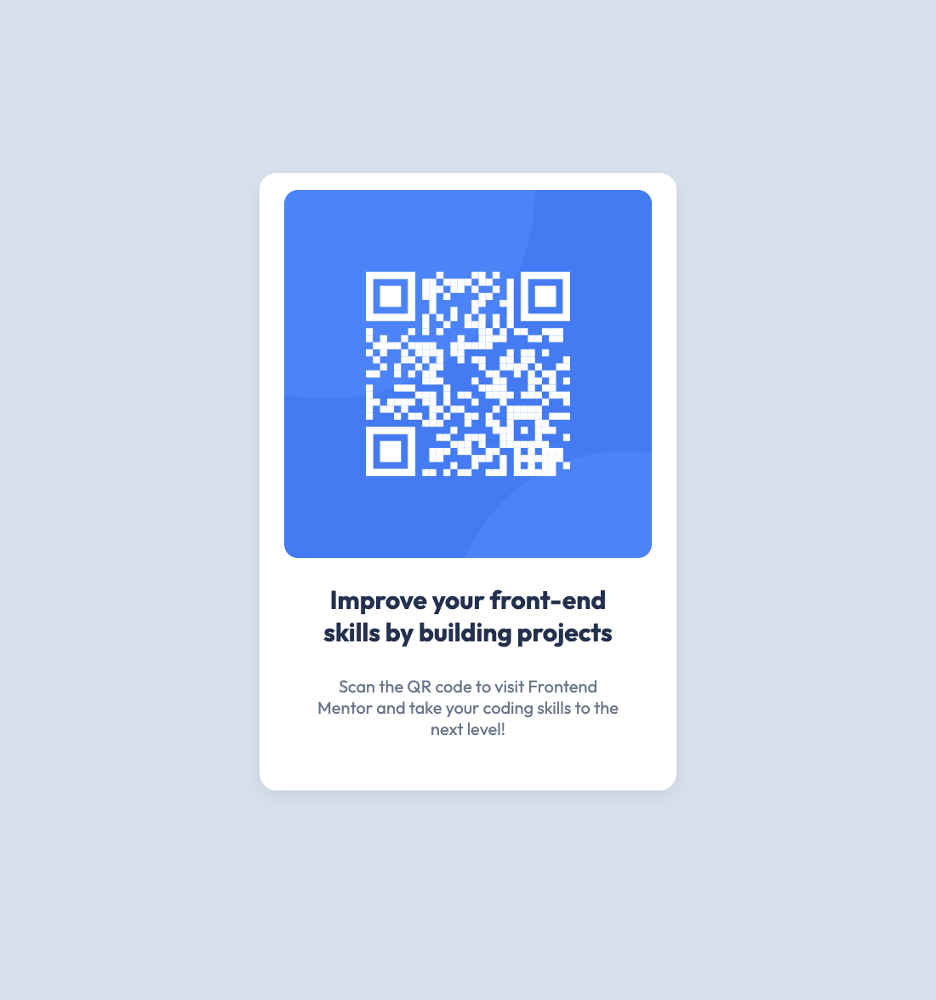

# Frontend Mentor - QR code component solution

This is a solution to the [QR code component challenge on Frontend Mentor](https://www.frontendmentor.io/challenges/qr-code-component-iux_sIO_H). Frontend Mentor challenges help you improve your coding skills by building realistic projects. 

## Table of contents

- [Overview](#overview)
  - [Screenshot](#screenshot)
  - [Links](#links)
- [My process](#my-process)
  - [Built with](#built-with)
  - [What I learned](#what-i-learned)
  - [Continued development](#continued-development)
  - [Useful resources](#useful-resources)
- [Author](#author)

## Overview

### Screenshot



### Links

- Solution URL: [GitHub Repository](https://github.com/haleytolar/QR-code)
- Live Site URL: [Live QR Code Component](https://haleytolar.github.io/QR-code/)

## My process

### Built with

- Semantic HTML5 markup
- CSS custom properties
- Flexbox
- Responsive design with media queries
- Mobile and desktop breakpoints

### What I learned

Through this project, I gained experience with creating responsive layouts that maintain consistent proportions across different screen sizes. I particularly focused on:

- Using flexbox for centering and vertical alignment
- Working with box shadows for subtle depth effects
- Managing proportions between mobile and desktop views with media queries
- Creating a responsive component that adapts to different screen sizes

One CSS technique I'm proud of is creating a properly centered component with flexbox:

```css
body {
  display: flex;
  justify-content: center;
  align-items: center;
  flex-direction: column;
}

I also implemented a responsive approach that uses fixed widths on mobile and viewport-relative units on desktop:

.code {
  width: 286px;
  border-radius: 8px;
  display: block;
  margin: 0;
}

.white-box {
  display: flex;
  flex-direction: column;
  justify-content: flex-start;
  background-color: white;
  height: auto;
  width: 320px;
  border-radius: 10px;
  box-shadow: 0 4px 12px rgba(0, 0, 0, 0.08);
  align-items: center;
  padding: 10px;
  gap: 10px;
}

@media screen and (min-width: 1024px){
  .white-box {
    width: 17vw;
  }
  
  .code {
    width: 15vw;
  }
}

This approach ensures the component looks good on mobile devices while scaling proportionally on larger screens.
Continued development
In future projects, I want to:

Further refine my responsive design approach for various screen sizes
Explore more advanced CSS techniques for creating visually appealing components
Improve accessibility features by adding proper ARIA attributes and focus states
Learn more about performance optimization for faster loading times
Practice creating more complex layouts while maintaining clean, maintainable code

Useful resources

MDN Web Docs on Flexbox - This helped me understand flexbox layout concepts and how to properly center elements.
CSS Tricks - A Complete Guide to Flexbox - An excellent visual guide that breaks down flexbox properties.
Frontend Mentor - The challenges on this platform provide great opportunities to practice and improve HTML/CSS skills.

Author
Frontend Mentor - @haleytolar